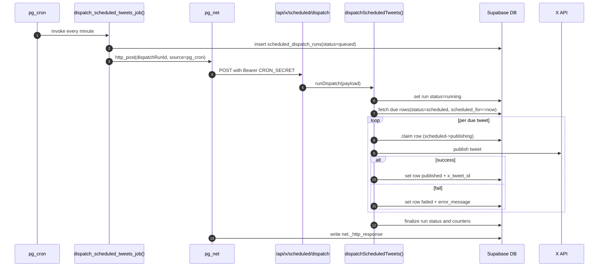
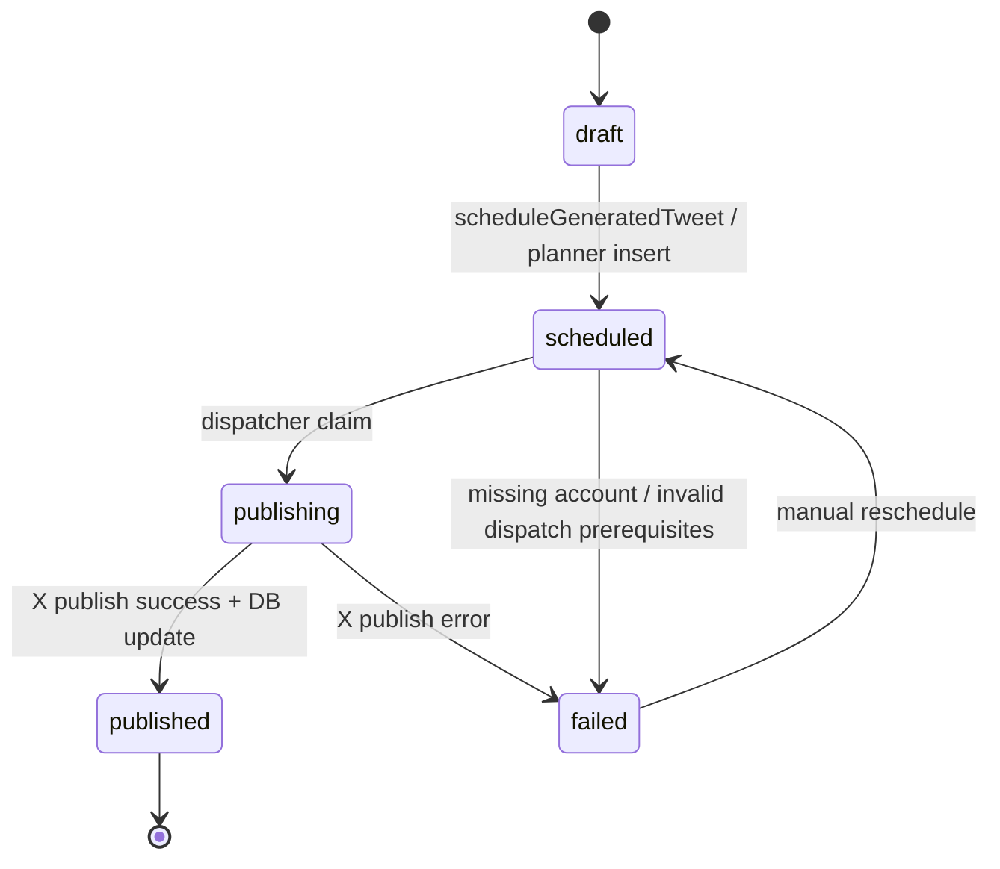
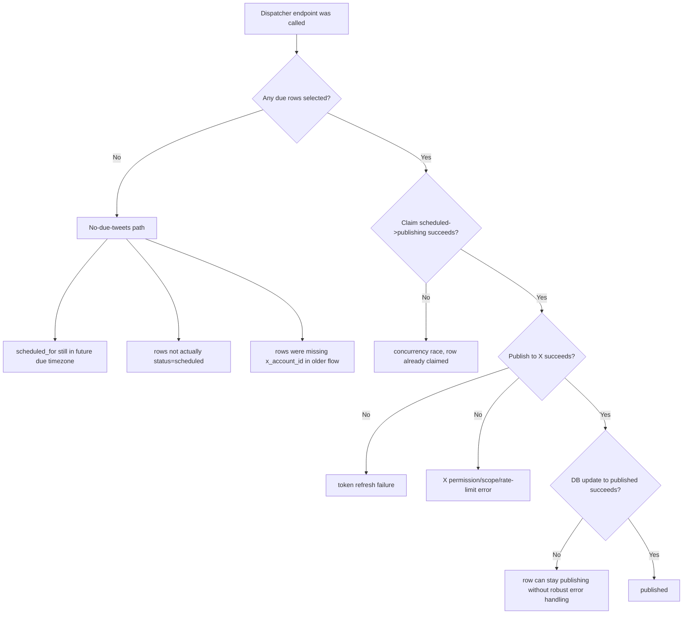
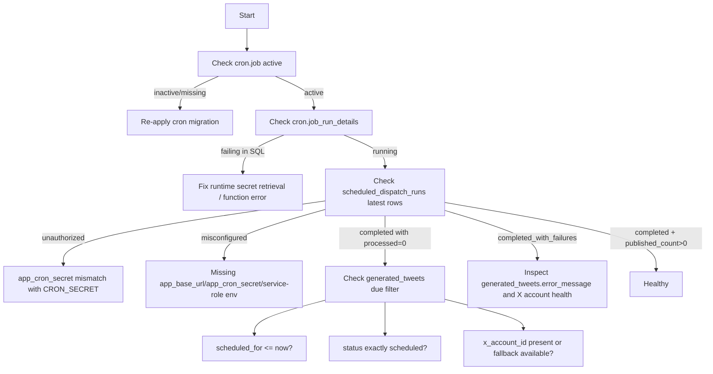

# Scheduled Posting Runbook

This document explains the full scheduled posting pipeline, where bottlenecks happen, and how to debug it quickly when cron calls the dispatcher but tweets do not publish.

## 1) End-to-end architecture

```mermaid
flowchart LR
  A[User schedules post<br/>status=scheduled, scheduled_for set] --> B[(public.generated_tweets)]
  C[pg_cron every minute<br/>dispatch-scheduled-tweets] --> D[public.dispatch_scheduled_tweets_job]
  D --> E[(public.scheduled_dispatch_runs<br/>status=queued)]
  D --> F[pg_net http_post]
  F --> G[/api/x/scheduled/dispatch]
  G --> H[dispatchScheduledTweets]
  H --> I[(select due rows from generated_tweets)]
  I --> J[claim row<br/>scheduled -> publishing]
  J --> K[publishTweetWithStoredConnection]
  K --> L[X API v2 tweet endpoint]
  L --> M[(update generated_tweets<br/>published or failed)]
  H --> N[(update scheduled_dispatch_runs<br/>completed/completed_with_failures/failed)]
  F --> O[(net._http_response)]
  E --> P[(scheduled_dispatch_run_http_responses view)]
  O --> P
  N --> P
```

## 2) Worker sequence (request-level)



## 3) Tweet lifecycle state machine



## 4) High-probability bottlenecks



## 5) Required runtime secrets

The app and Supabase cron must share the same secret.

app_base_url must be a public HTTPS origin. Supabase cloud cron cannot call localhost.

```sql
select private.set_runtime_secret('app_base_url', 'https://your-app-domain.example');
select private.set_runtime_secret('app_cron_secret', '<same value as app CRON_SECRET>');
```

Next app env must include:

- CRON_SECRET
- SUPABASE_SERVICE_ROLE_KEY
- PUBLIC_SUPABASE_URL or NEXT_PUBLIC_SUPABASE_URL

## 6) Operator triage flow



## 7) SQL checks you can run immediately

### A. Cron job exists and runs

```sql
select jobid, jobname, schedule, active
from cron.job
where jobname = 'dispatch-scheduled-tweets';
```

```sql
select *
from cron.job_run_details
where jobid in (
  select jobid
  from cron.job
  where jobname = 'dispatch-scheduled-tweets'
)
order by start_time desc
limit 20;
```

### B. HTTP handoff details

```sql
select *
from net._http_response
order by created desc
limit 20;
```

```sql
select *
from net._http_response
where status_code >= 400 or error_msg is not null
order by created desc
limit 20;
```

### C. Durable dispatch logs

```sql
select
  id,
  trigger_source,
  status,
  http_status,
  processed_count,
  published_count,
  failed_count,
  skipped_count,
  top_level_error,
  created_at,
  worker_started_at,
  worker_completed_at
from public.scheduled_dispatch_runs
order by created_at desc
limit 20;
```

```sql
select
  id,
  trigger_source,
  status,
  http_status,
  pg_net_status_code,
  pg_net_error_message,
  top_level_error,
  created_at,
  pg_net_responded_at
from public.scheduled_dispatch_run_http_responses
order by created_at desc
limit 20;
```

### D. Due tweet visibility

```sql
select
  id,
  user_id,
  status,
  scheduled_for,
  published_at,
  x_account_id,
  x_tweet_id,
  error_message,
  updated_at
from public.generated_tweets
where status in ('scheduled', 'publishing', 'failed')
order by scheduled_for asc nulls last, updated_at desc
limit 100;
```

Overdue scheduled rows:

```sql
select
  id,
  user_id,
  scheduled_for,
  x_account_id,
  error_message
from public.generated_tweets
where status = 'scheduled'
  and scheduled_for <= now()
order by scheduled_for asc;
```

Overdue scheduled rows still missing account linkage:

```sql
select
  id,
  user_id,
  scheduled_for,
  x_account_id
from public.generated_tweets
where status = 'scheduled'
  and scheduled_for <= now()
  and x_account_id is null
order by scheduled_for asc;
```

Stale publishing rows (likely interrupted claim/publish cycle):

```sql
select
  id,
  user_id,
  scheduled_for,
  updated_at,
  error_message
from public.generated_tweets
where status = 'publishing'
  and updated_at <= now() - interval '15 minutes'
order by updated_at asc;
```

### E. Secret presence

```sql
select name, updated_at
from private.runtime_secrets
where name in ('app_base_url', 'app_cron_secret')
order by name;
```

## 8) Manual recovery options

Process one tweet:

```bash
curl -X POST "https://your-app-domain.example/api/x/scheduled/dispatch" \
  -H "Authorization: Bearer <CRON_SECRET>" \
  -H "Content-Type: application/json" \
  -d "{\"tweetId\":\"<generated_tweet_id>\",\"source\":\"manual_recovery\"}"
```

Process all currently due:

```bash
curl -X POST "https://your-app-domain.example/api/x/scheduled/dispatch" \
  -H "Authorization: Bearer <CRON_SECRET>" \
  -H "Content-Type: application/json" \
  -d "{\"source\":\"manual_recovery\"}"
```

Reset stale publishing rows back to scheduled (only after confirming they were not actually posted to X):

```sql
update public.generated_tweets
set
  status = 'scheduled',
  error_message = null,
  updated_at = now()
where status = 'publishing'
  and updated_at <= now() - interval '15 minutes';
```

## 9) Most likely root causes for "cron called dispatcher but nothing posted"

1. scheduled_for is still in the future because of timezone assumptions.
2. Rows are not in status scheduled (for example stuck at publishing).
3. x_account_id linkage is missing for scheduled rows created by alternate scheduling paths.
4. CRON secret mismatch leads to unauthorized worker calls.
5. Worker can reach DB but publishing to X fails (token refresh, revoked app permissions, scope mismatch, or rate limits).

## 10) Recent hardening notes

- Dispatcher now attempts to resolve a fallback x_account_id by user when missing and will explicitly fail the row with a clear error if no X account exists.
- Seven-day planner scheduling now requires an active X account before creating scheduled rows.
